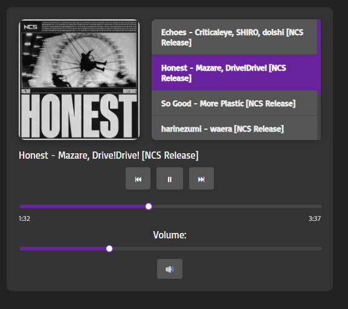

# 🎧 Media Player NCS

Um **player de música moderno e minimalista** desenvolvido em **HTML, CSS e JavaScript puro**, com suporte a **playlist dinâmica, barra de progresso animada, controle de volume** e **rolagem automática até a faixa atual**.  
Todas as músicas utilizadas são **livres de direitos autorais** (*NCS Releases*).

---

## 🚀 Funcionalidades

- 🎵 Reprodução de músicas com capa e título dinâmicos  
- ⏯️ Botões de **Play/Pause**, **Próxima** e **Anterior**  
- 📜 Playlist com **scroll automático** até a música atual  
- 🎚️ Controle de **volume** e **linha do tempo interativa**  
- ⏱️ Exibição do **tempo atual e total da faixa**  
- 💿 Capa do álbum muda automaticamente conforme a faixa  
- ⚙️ Feito com **JavaScript puro**, sem frameworks  

---

## 🗂️ Estrutura do Projeto

```
Media-Player/
│
├── assets/
│   ├── covers/        # Capas das músicas
│   ├── img/           # Ícones e imagens do player
│   └── songs/         # Arquivos de áudio (NCS)
│
├── css/
│   └── style.css      # Estilos visuais
│
├── js/
│   └── main.js        # Lógica do player
│
├── index.html         # Página principal
├── README.md          # Documentação do projeto
└── .gitattributes     # Configurações de versionamento
```

---

## 🧠 Tecnologias Utilizadas

- **HTML5** — Estrutura e semântica  
- **CSS3** — Estilização moderna e responsiva  
- **JavaScript (Vanilla)** — Controle da playlist e interatividade  

---

## 🖼️ Demonstração



---

## 🔊 Créditos das Músicas (NCS)

As faixas são de uso livre com créditos à [NoCopyrightSounds](https://ncs.io/):

- **waera - harinezumi**  
  [Download/Stream](http://ncs.io/harinezumi) | [YouTube](http://ncs.lnk.to/harinezumiAT/youtube)

- **Carpe & Zachz Winner - wooyawooya**  
  [Download/Stream](http://ncs.io/wooyawooya) | [YouTube](http://ncs.lnk.to/wooyawooyaAT/youtube)

- **Mazare, DriveDrive! - Honest**  
  [Download/Stream](http://ncs.io/honest) | [YouTube](http://ncs.lnk.to/honestAT/youtube)

- **criticaleye, Shiro, dolshi - Echoes**  
  [Download/Stream](http://ncs.io/ce_echoes) | [YouTube](http://ncs.lnk.to/ce_echoesAT/youtube)

- **More Plastic - So Good**  
  [Download/Stream](http://ncs.io/SoGood) | [YouTube](http://ncs.lnk.to/SoGoodAT/youtube)

- **Youth - Stuck in my head**  
  [Download/Stream](http://ncs.io/stuckinmyhead) | [YouTube](http://ncs.lnk.to/stuckinmyheadAT/youtube)

---

## 💡 Como Usar

1. Clone o repositório:
   ```bash
   git clone https://github.com/seuusuario/Media-Player.git
   ```
2. Abra o projeto no seu editor (VS Code recomendado).
3. Inicie o player abrindo o arquivo:
   ```
   index.html
   ```
4. Toque as faixas, ajuste o volume e explore o visual ✨

---

## 🌐 Deploy Online

Você pode acessar o player diretamente pelo GitHub Pages:  
[https://xd-enrique.github.io/Media-Player](https://xd-enrique.github.io/Media-Player)

---

## 🧩 Futuras Melhorias

- 🔁 Modo **loop e shuffle**
- 🔊 Visualizador de ondas animado (com *Lottie* ou *Canvas*)
- 🌗 Modo claro/escuro
- 📱 Layout totalmente responsivo

---

## 🧑‍💻 Autor

**Enrique Zoz de Souza**  
💼 Estudante e entusiasta de tecnologia e programação  
📫 [GitHub](https://github.com/XD-Enrique)

---

## ⚖️ Licença

Este projeto é licenciado sob a [MIT License](LICENSE).  
As músicas pertencem aos respectivos artistas sob licença **NCS Release**.