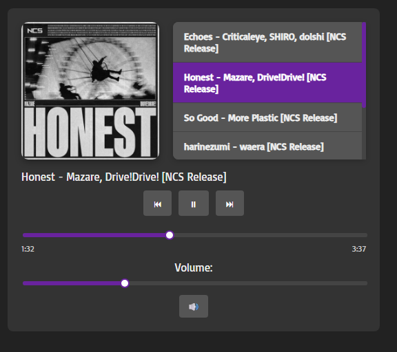

# Media Player

Um reprodutor de mídia responsivo e interativo construído inteiramente com HTML, CSS e JavaScript puro (Vanilla JS). Este projeto foi desenvolvido para treinar o domínio de manipulação do DOM, gerenciamento de estado complexo e boas práticas de interface de usuário (UI/UX), sem depender de bibliotecas ou frameworks externos.

## Demonstração e Deploy Online

A aplicação está disponível online através do GitHub Pages:
[Acessar Media Player](https://xd-enrique.github.io/Media-Player)



## Funcionalidades Principais e Decisões Técnicas

* **Controles de Áudio Customizados:** Interface completa com botões nativos estilizados para Play/Pause, Mute, Avançar e Voltar.
* **Navegação Baseada em Histórico (Pilhas):** Diferente de players convencionais que apenas seguem a ordem linear, este projeto implementa estruturas de dados em pilha (arrays `anterior` e `proximo`) para memorizar o histórico exato de navegação do usuário.
* **Lógica de Duplo Clique (Debounce):** Implementação de um temporizador manual para diferenciar um clique simples (reiniciar a faixa atual) de um clique duplo (retornar à faixa anterior no histórico) no botão de controle.
* **Playlist Dinâmica e Inteligente:** A lista de reprodução é gerada dinamicamente via JavaScript. O item em execução é destacado e a lista realiza uma rolagem automática (`scrollIntoView`) para manter a faixa atual sempre centralizada na visão do usuário.
* **Persistência de Dados:** Utilização da API `localStorage` para salvar o volume anterior do usuário quando o player é silenciado, restaurando o valor exato de forma inteligente ao ser reativado.
* **Interface e Inputs Customizados:** Barras de progresso e volume estilizadas nativamente usando pseudo-elementos CSS e variáveis CSS para representar visualmente a porcentagem atual da música de forma dinâmica.

## Estrutura do Projeto

```text
Media-Player/
│
├── assets/
│   ├── covers/        # Capas das músicas
│   ├── img/           # Ícones e imagens do player
│   └── songs/         # Arquivos de áudio (NCS)
│
├── css/
│   └── style.css      # Estilos visuais globais e de componentes
│
├── js/
│   └── main.js        # Lógica principal do player, eventos e estado
│
├── index.html         # Estrutura semântica principal
├── README.md          # Documentação do projeto
└── .gitattributes     # Configurações de versionamento
```

## Tecnologias Utilizadas

* HTML5 (Semântica e estruturação)
* CSS3 (Custom Properties, Flexbox, Pseudo-elementos)
* JavaScript / ES6+ (Audio API nativa, manipulação de eventos, manipulação de arrays)

## Instalação e Uso Local

1. Clone o repositório:
   ```bash
   git clone https://github.com/XD-Enrique/Media-Player.git
   ```
2. Abra o projeto em seu editor de código de preferência (VS Code recomendado).
3. O projeto não requer nenhuma etapa de build ou instalação de dependências. Basta abrir o arquivo `index.html` em um navegador web moderno.

## Créditos das Músicas (NCS)

Para garantir o uso livre de direitos autorais, todas as faixas incluídas neste projeto são fornecidas pela [NoCopyrightSounds](https://ncs.io/):

* **waera - harinezumi** [Download/Stream](http://ncs.io/harinezumi) | [YouTube](http://ncs.lnk.to/harinezumiAT/youtube)
* **Carpe & Zachz Winner - wooyawooya** [Download/Stream](http://ncs.io/wooyawooya) | [YouTube](http://ncs.lnk.to/wooyawooyaAT/youtube)
* **Mazare, DriveDrive! - Honest** [Download/Stream](http://ncs.io/honest) | [YouTube](http://ncs.lnk.to/honestAT/youtube)
* **criticaleye, Shiro, dolshi - Echoes** [Download/Stream](http://ncs.io/ce_echoes) | [YouTube](http://ncs.lnk.to/ce_echoesAT/youtube)
* **More Plastic - So Good** [Download/Stream](http://ncs.io/SoGood) | [YouTube](http://ncs.lnk.to/SoGoodAT/youtube)
* **Youth - Stuck in my head** [Download/Stream](http://ncs.io/stuckinmyhead) | [YouTube](http://ncs.lnk.to/stuckinmyheadAT/youtube)

## Autor

**Enrique Zoz de Souza**
Estudante e entusiasta de tecnologia e programação.
Perfil no [GitHub](https://github.com/XD-Enrique)

## Licença

As músicas pertencem aos respectivos artistas sob licença NCS Release.
